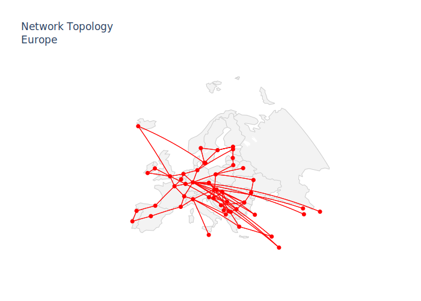

---
tags:
  - napalm
  - beginner
  - codespaces
  - python
---

# Topology with NAPALM


|             |                                                                                                          |
| ----------: | :--------------------------------------------------------------------------------------------------------|
| Level       | beginner                                                                                                 |
| Repo        | [https://github.com/NetAutLabs/topology_with_napalm](https://github.com/NetAutLabs/topology_with_napalm) |
| Discussion  | [Discussion GitHub Repo](https://github.com/NetAutLabs/topology_with_napalm/discussions)                 |
| Codespaces  | :material-check: [GitHub Codespaces](https://codespaces.new/NetAutLabs/topology_with_napalm)             |


In this lab, you will collect network topology data from simulated network devices using NAPALM and visualize it. The lab is divided into three parts.

The network devices are simulated using NAPALM mock devices. The necessary files are located in the `mocked_napalm_data` directory. The network is inspired by the [GÉANT Connectivity Map](https://map.geant.org/) and contains simplified data for Europe. The `node_infos.json` file includes all network devices enriched with metadata.

## Display Neighbors with a Rich Table

The goal of this section is to print a table of network neighbors received from a router. To achieve this, complete the TODOs in `topology_visualizer/aa_neighbor_table.py`. This file also includes an example of how to interact with the NAPALM mock driver.

Once the script is complete, it can be executed as follows to generate the neighbor table for the router `che01`:

```bash
python topology_visualizer/aa_neighbor_table.py che01
```

## Diagrams from Textual Descriptions

Various tools can convert textual descriptions into diagrams. [Kroki](https://kroki.io/) provides a unified API to access multiple diagramming tools without needing to install them. In this section, you'll generate network diagrams using [GraphViz](https://www.graphviz.org/) and [D2](https://github.com/terrastruct/d2). Complete the TODOs in `topology_visualizer/bb_kroki.py`. You may use [Nornir](https://nornir.readthedocs.io/en/stable/index.html) to collect all the topology data.

Once the script is complete, it can be executed as follows to generate an SVG using GraphViz:

```bash
python topology_visualizer/bb_kroki.py graphviz
```

Considerations:

- Experiment with different approaches, such as grouping routers by country or adding color, to improve the appearance.
- Do other tools or languages produce better results?
- Can you enrich the diagrams with additional information?

!!! warning


    If you're working with sensitive data, avoid sending it to a public server. Instead, consider self-hosting Kroki or installing the necessary tools locally.


## Geographical Map

Since we have the coordinates of the routers in `node_infos.json`, it's logical to draw the network graph on a geographical map. [Plotly](https://plotly.com/python/) offers a simple interface for generating interactive diagrams and exporting them as static images. Complete the TODOs in `topology_visualizer/cc_plotly.py`, then execute the script as shown below to generate a static image `plotly.svg` and an interactive map in `plotly.html`. You may use [pandas](https://pandas.pydata.org/) for data manipulation.

```bash
python topology_visualizer/cc_plotly.py
```

The basic map should look similar to this example. However, you should try to improve the appearance.




